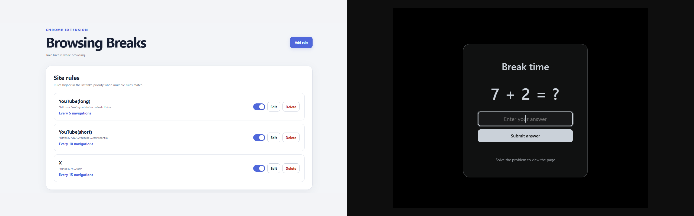

# Browsing Breaks

> Take breaks while browsing.



Available in Japanese and English. The settings page, lock screen, extension name, and description automatically follow Chrome's display language.

This is a Chrome extension that interrupts navigation to a specified URL at set intervals or after a certain number of visits, locking the page until you correctly solve an addition problem.

日本語と英語に対応しています。Chromeの表示言語に合わせて、設定画面、ロック画面、拡張機能名と説明の表示言語が自動的に切り替わります。

指定したURLへの移動を一定時間または一定回数ごとに中断し、足し算に正解するまでページをロックするChrome拡張機能です。

時間方式の基準日時、または移動回数方式の最終移動日時から12時間以上経過した場合は、次の対象URL遷移では問題を表示せず状態を初期化します。その次の遷移から通常の計測を再開します。

出題中でも、出題元のサイト設定に一致しないWebサイトへ移動できます。移動先ではロックと拡張機能によるミュートを解除しますが、出題元の状態はリセットされないため、対象サイトへ戻ると再度判定されます。

## インストール

1. Chromeで `chrome://extensions/` を開く
2. 「デベロッパー モード」を有効にする
3. 「パッケージ化されていない拡張機能を読み込む」を選ぶ
4. このディレクトリを選ぶ
5. ツールバーの Browsing Breaks アイコンを押し、サイト設定を追加する

通常の `http://` / `https://` ページが対象です。Chrome内部ページ、Chromeウェブストア、他の拡張機能ページなど、ChromeがContent Scriptの注入を禁止しているページでは動作しません。

## テスト

Node.js 18以降で次を実行します。

```powershell
npm test
```
